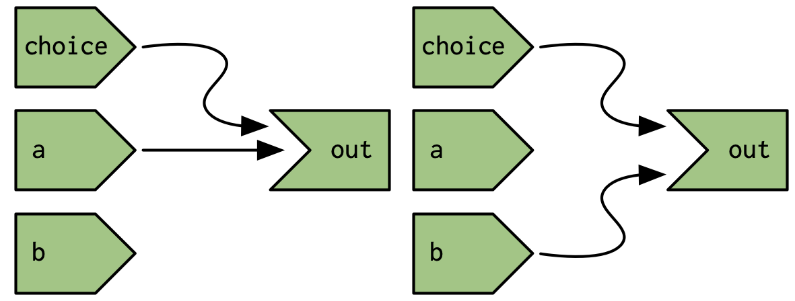

```{r setup}
knitr::opts_chunk$set(eval = FALSE)
```


```{r}
library(shiny)
```


# 14.2 A step-by-step tour of reactive execution


```{r}
ui <- fluidPage(
  numericInput("a", "a", value = 10),
  numericInput("b", "b", value = 1),
  numericInput("c", "c", value = 1),
  plotOutput("x"),
  tableOutput("y"),
  textOutput("z")
)

server <- function(input, output, session) {
  rng <- reactive(input$a * 2)
  smp <- reactive(sample(rng(), input$b, replace = TRUE))
  bc <- reactive(input$b * input$c)
  
  output$x <- renderPlot(hist(smp()))
  output$y <- renderTable(max(smp()))
  output$z <- renderText(bc())
}
shinyApp(ui, server)
```


# 14.3 Dynamism


```{r}
ui <- fluidPage(
  selectInput("choice", "A or B?", c("a", "b")),
  numericInput("a", "a", 0),
  numericInput("b", "b", 10),
  textOutput("out")
)

server <- function(input, output, session) {
  output$out <- renderText({
    if (input$choice == "a") {
      input$a
    } else {
      input$b
    }
  }) 
}
shinyApp(ui, server)
```


its graph is looks like either of the graphs blow:



but 

```{r}
output$out <- renderText({
  a <- input$a
  b <- input$b

  if (input$choice == "a") {
    a
  } else {
    b
  }
}) 
```


the `out` depends on both `$a` and `$b`


# 14.4 The reactlog package


```{r}
library(reactlog)
reactlog_enable()
```


```{r}
ui <- fluidPage(
  selectInput("choice", "A or B?", c("a", "b")),
  numericInput("a", "a", 0),
  numericInput("b", "b", 10),
  textOutput("out")
)

server <- function(input, output, session) {
  output$out <- renderText({
    if (input$choice == "a") {
      input$a
    } else {
      input$b
    }
  }) 
}
shinyApp(ui, server)
```

run the app and the press "ctrl + F3"
or 
After the app has closed, run `shiny::reactlogShow()` to see the log for the complete session.


( Connections that are not currently active (but were in the past or will be in the future) are drawn as thin dotted lines.)