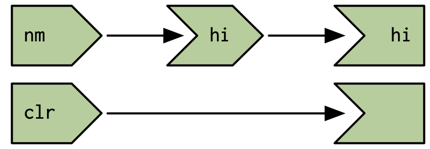

```{r setup}
knitr::opts_chunk$set(eval = FALSE)
```


```{r}
library(shiny)
```

# 16.2 What doesn’t the reactive graph capture?

```{r}
ui <- fluidPage(
  textInput("nm", "name"),
  actionButton("clr", "Clear"),
  textOutput("hi")
)
server <- function(input, output, session) {
  hi <- reactive(paste0("Hi ", input$nm))
  output$hi <- renderText(hi())
  observeEvent(input$clr, {
    updateTextInput(session, "nm", value = "")
  })
}
shinyApp(ui, server)
```


```{r}
reactlog::reactlog_enable()
```


# 16.3 Case studies

## 16.3.1 One output modified by multiple inputs

```{r}
ui <- fluidPage(
  actionButton("drink", "drink me"),
  actionButton("eat", "eat me"),
  textOutput("notice")
)
server <- function(input, output, session) {
  notice <- reactiveVal("")
  observeEvent(input$drink, notice("You are no longer thirsty"))
  observeEvent(input$eat, notice("You are no longer hungry"))

  output$notice <- renderText(notice())
}
shinyApp(ui, server)
```

```{r}
ui <- fluidPage(
  actionButton("up", "up"),
  actionButton("down", "down"),
  textOutput("n")
)
server <- function(input, output, session) {
  n <- reactiveVal(0)
  observeEvent(input$up, n(n() + 1))
  observeEvent(input$down, n(n() - 1))
  
  output$n <- renderText(n())
}
shinyApp(ui, server)
```

## 16.3.2 Accumulating inputs

```{r}
ui <- fluidPage(
  textInput("name", "name"),
  actionButton("add", "add"),
  textOutput("names")
)
server <- function(input, output, session) {
  names <- reactiveVal()
  observeEvent(input$add, {
    names(c(input$name, names()))
    updateTextInput(session, "name", value = "")
  })
  
  output$names <- renderText(names())
}
shinyApp(ui, server)
```

```{r}
ui <- fluidPage(
  textInput("name", "name"),
  actionButton("add", "add"),
  actionButton("del", "delete"),
  textOutput("names")
)
server <- function(input, output, session) {
  names <- reactiveVal()
  observeEvent(input$add, {
    names(union(names(), input$name))
    updateTextInput(session, "name", value = "")
  })
  observeEvent(input$del, {
    names(setdiff(names(), input$name))
    updateTextInput(session, "name", value = "")
  })
  
  output$names <- renderText(names())
}
shinyApp(ui, server)
```

## 16.3.3 Pausing animations

```{r}
ui <- fluidPage(
  actionButton("start", "start"),
  actionButton("stop", "stop"),
  textOutput("n")
)
server <- function(input, output, session) {
  running <- reactiveVal(FALSE)
  observeEvent(input$start, running(TRUE))
  observeEvent(input$stop, running(FALSE))
  
  n <- reactiveVal(0)
  observe({
    if (running()) {
      n(isolate(n()) + 1)
      invalidateLater(250)
    }
  })
  output$n <- renderText(n())
}
shinyApp(ui, server)
```

## 16.3.4 Exercises

### question 1

```{r}
library(shiny)

ui <- fluidPage(
  actionButton("rnorm", "Normal"),
  actionButton("runif", "Uniform"),
  plotOutput("plot")
)

server <- function(input, output, session) {
  dist <- reactiveVal()
  
  observeEvent(input$rnorm, {
    dist(rnorm(100))
  })
  
  observeEvent(input$runif, {
    dist(runif(100))
  })
  output$plot <- renderPlot({
    req(dist())
    plot(dist())
  })
}

shinyApp(ui, server)
```

### question 2

```{r}
library(shiny)

ui <- fluidPage(
  selectInput("type", "type", c("Normal", "Uniform")),
  actionButton("go", "go"),
  plotOutput("plot")
)

server <- function(input, output, session) {
  dist <- reactiveVal()
  
  observeEvent(input$go, {
    if(input$type == "Normal")
      dist(rnorm(100))
    else
      dist(runif(100))
  })
  
  output$plot <- renderPlot({
    req(dist())
    plot(dist())
  })
}

shinyApp(ui, server)
```

### question 3

```{r}
library(shiny)

ui <- fluidPage(
  actionButton("rnorm", "Normal"),
  actionButton("runif", "Uniform"),
  plotOutput("plot")
)

server <- function(input, output, session) {
  dist <- reactiveVal()
  
  observeEvent(input$rnorm, {
    dist(rnorm(100))
  })
  
  observeEvent(input$runif, {
    dist(runif(100))
  })
  output$plot <- renderPlot({
    req(dist())
    plot(dist())
  })
}

shinyApp(ui, server)
```


```{r}
library(shiny)

ui <- fluidPage(
  selectInput("type", "type", c("Normal", "Uniform")),
  actionButton("go", "go"),
  plotOutput("plot")
)

server <- function(input, output, session) {
  dist <- reactiveVal()
  
  generator <- reactive({
    req(input$go)
    
    if(isolate(input$type) == "Normal")
      dist(rnorm(100))
    else
      dist(runif(100))
  })
  
  output$plot <- renderPlot({
    generator()
    plot(dist())
  })
}

shinyApp(ui, server)
```


# 16.4 Anti-patterns

`reactive` expers better than observers becuase of propagating the errors to the top level.
