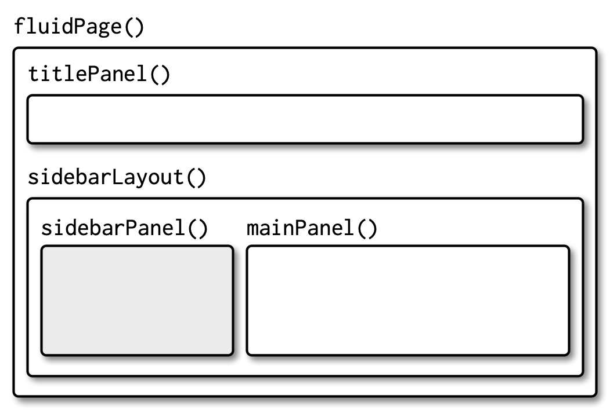
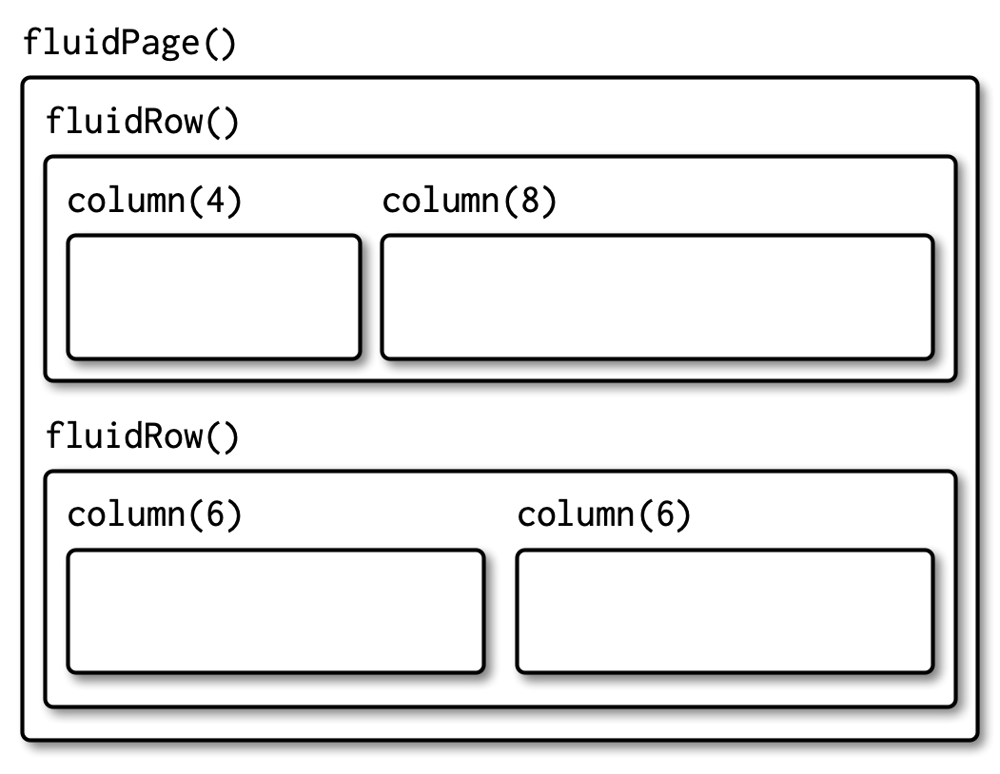

```{r setup}
knitr::opts_chunk$set(eval = FALSE)
```


```{r}
library(shiny)
```


# 3.2 Inputs

## 3.2.1 Common structure
there are 3 common argument for all input controls:
1- `nameid`: for accessing from back-end(server)
2- `label`: human readable label
3- `value`: the default value of the input

the `nameid` argument of the input must be a simple string with no period, dash or space and also they must be unique.


## 3.2.2 Free text

Collect small amounts of text with `textInput()`, passwords with` passwordInput()`, and paragraphs of text with `textAreaInput()`.


```{r}
ui <- fluidPage(
  textInput("name", "What's your name?"),
  passwordInput("password", "What's your password?"),
  textAreaInput("story", "Tell me about yourself", rows = 3)
)
```

```{r}
library(shiny)

ui <- fluidPage(
  textInput("name", "What's your name?"),
  passwordInput("password", "What's your password?"),
  textAreaInput("story", "Tell me about yourself", rows = 3)
)

server <- function(input, output, session) {
  
}

shinyApp(ui, server)
```

## 3.2.3 Numeric inputs

```{r}
ui <- fluidPage(
  numericInput("num", "Number one", value = 0, min = 0, max = 100),
  sliderInput("num2", "Number two", value = 50, min = 0, max = 100),
  sliderInput("rng", "Range", value = c(10, 20), min = 0, max = 100)
)
```

example:

```{r}
library(shiny)

ui <- fluidPage(
  numericInput("num", "Number one", value = 0, min = 0, max = 100),
  sliderInput("num2", "Number two", value = 50, min = 0, max = 100),
  sliderInput("rng", "Range", value = c(10, 20), min = 0, max = 100)
)

server <- function(input, output, session) {
  
}

shinyApp(ui, server)
```
use slider for small ranges or or cases where the precise value is not so important.

to customize the sliders use `?sliderInput`.

## 3.2.4 Dates

```{r}
ui <- fluidPage(
  dateInput("dob", "When were you born?"),
  dateRangeInput("holiday", "When do you want to go on vacation next?")
)
```
these function have a nice calender picker.
example:

```{r}
library(shiny)

ui <- fluidPage(
  dateInput("dob", "When were you born?"),
  dateRangeInput("holiday", "When do you want to go on vacation next?")
)

server <- function(input, output, session) {
  
}

shinyApp(ui, server)
```
to customize the calender for other countries, use `format`, `language` and `weekstart` arguments.


## 3.2.5 Limited choices

for prespecified options use:

```{r}
animals <- c("dog", "cat", "mouse", "bird", "other", "I hate animals")

ui <- fluidPage(
  selectInput("state", "What's your favourite state?", state.name),
  radioButtons("animal", "What's your favourite animal?", animals)
)
```

example:
```{r}
library(shiny)

animals <- c("dog", "cat", "mouse", "bird", "other", "I hate animals")

ui <- fluidPage(
  selectInput("state", "What's your favourite state?", state.name),
  radioButtons("animal", "What's your favourite animal?", animals)
)
server <- function(input, output, session) {
  
}

shinyApp(ui, server)
```

`radioButtons()` can be customized via `choiceNames/choiceValues` arguments, for example:

```{r}
library(shiny)

ui <- fluidPage(
  radioButtons("rb", "Choose one:",
    choiceNames = list(
      icon("angry"),
      icon("smile"),
      icon("sad-tear")
    ),
    choiceValues = list("angry", "happy", "sad")
  )
)

server <- function(input, output, session) {
  
}

shinyApp(ui, server)
```
you can use `multiple` argument of the `selectInput()` to select multiple option.
you can not select multiple input in `radioButton()` but you can use ` checkboxGroupInput()`.


```{r}
library(shiny)

ui <- fluidPage(
  checkboxGroupInput("animal", "What animals do you like?", animals)
)
server <- function(input, output, session) {
  
}

shinyApp(ui, server)
```

to use checkbox for single selection use `checkboxInput()`.

```{r}
ui <- fluidPage(
  checkboxInput("cleanup", "Clean up?", value = TRUE),
  checkboxInput("shutdown", "Shutdown?")
)
```


## 3.2.6 File uploads

```{r}
ui <- fluidPage(
  fileInput("upload", NULL)
)
```

```{r}
ui <- fluidPage(
  fileInput("upload", NULL)
)

server <- function(input, output, session) {
  
}

shinyApp(ui, server)
```


## 3.2.7 Action buttons

```{r}
ui <- fluidPage(
  actionButton("click", "Click me!"),
  actionButton("drink", "Drink me!", icon = icon("cocktail"))
)
```

customize it with `class` argument.
to span the entire width of the element they are embedded within, use `"btn-block"`. 
```{r}
ui <- fluidPage(
  fluidRow(
    actionButton("click", "Click me!", class = "btn-danger"),
    actionButton("drink", "Drink me!", class = "btn-lg btn-success")
  ),
  fluidRow(
    actionButton("eat", "Eat me!", class = "btn-block")
  )
)

server <- function(input, output, session){
  
}

shinyApp(ui, server)
```

## 3.2.8 Exercises

### 1

```{r}
library(shiny)

ui <- fluidPage(
  textInput("name", "please tell us your name:", placeholder = "Your name")
)

server <- function(input, output, session) {
  
}

shinyApp(ui, server)
```

### 2

```{r}
?sliderInput
```

```{r}
library(shiny)

ui <- fluidPage(
  sliderInput("date", "when should we deliver?", min = as.Date("2020-09-16"), max = as.Date("2020-09-23"),
    value = as.Date("2020-09-17"))
)

server <- function(input, output, session) {
  
}

shinyApp(ui, server)
```


### 3

```{r}
?selectInput
```

```{r}
options <- list("hello" = list("arash", "asghar", "akbar"), "bye" = list("haratian", "NA", "NA"))

library(shiny)

ui <- fluidPage(
  selectInput("subgroup", "choose an option", choices = options, )
)

server <- function(input, output, session) {
  
}

shinyApp(ui, server)
```
### 4
```{r}
library(shiny)

ui <- fluidPage(
  sliderInput("sliderValue", "the interval of the slider is 5:",
    min = 0, max = 100, value = 5,
    step = 5, animate = TRUE)
)

server <- function(input, output, session) {
  
}

shinyApp(ui, server)
```

### 5

```{r}
library(shiny)

ui <- fluidPage(
  numericInput("number", "Select a value", value = 150, min = 0, max = 1000, step = 50)
)

server <- function(input, output, session) {
  
}

shinyApp(ui, server)
```

the `step` argument just control the arrows step and user still can select any number. 


# 3.3 Outputs

the output in ui is a placeholder for back end and will filled by server function and also there is an corresponding render function in back end.
the ID of the output must be unique.


## 3.3.1 Text

to output a regular text use `textOutput()` and to output a code and console output use `verbatimTextOutput()`.


```{r}
library(shiny)

ui <- fluidPage(
  textOutput("text"),
  verbatimTextOutput("code")
)
server <- function(input, output, session) {
  output$text <- renderText("Hello friend!")
  output$code <- renderPrint(summary(1:10))
}

shinyApp(ui, server)
```

there are two different render function:
`renderText()` combines the result into a single string.
`renderPrint()` prints the result.

```{r, eval=TRUE}
renderText("foo")()
renderPrint("foo")()
```

## 3.3.2 Tables
`tableOutput()` and `renderTable()` render a static table.
`dataTableOutput()` and `renderDataTable()` render a dynamic table.

```{r}
ui <- fluidPage(
  tableOutput("static"),
  dataTableOutput("dynamic")
)
server <- function(input, output, session) {
  output$static <- renderTable(head(mtcars))
  output$dynamic <- renderDataTable(mtcars, options = list(pageLength = 5))
}
shinyApp(ui, server)
```

## 3.3.3 Plots
```{r}
ui <- fluidPage(
  plotOutput("plot", width = "400px", click = "plot_click"),
  verbatimTextOutput("text")
)
server <- function(input, output, session) {
  output$plot <- renderPlot(plot(1:5), res = 96)
  output$text <- renderPrint(input$plot_click)
}
shinyApp(ui, server)
```

`plotOutput()` has a number of arguments like `click`, `dblclick`, and `hover`.


## 3.3.5 Exercises

### question 1

```{r}
library(shiny)

ui <- fluidPage(
  plotOutput("plot", width = "700px", height = "400px")
)

server <- function(input, output, session) {
  output$plot <- renderPlot(plot(1:5), res = 96)
}

shinyApp(ui, server)
```


### question 2
see the [options site](https://datatables.net/reference/option/).

```{r}
ui <- fluidPage(
  dataTableOutput("table")
)
server <- function(input, output, session) {
  output$table <- renderDataTable(mtcars, options = list(pageLength = 5, ordering = FALSE, searching = FALSE))
}
shinyApp(ui, server)
```


```{r}
?renderDataTable
?dataTableOutput
```

# 3.4 Layouts

## 3.4.1 Overview
```{r}
library(shiny)

ui <- fluidPage(
  titlePanel("Hello Shiny!"),
  sidebarLayout(
    sidebarPanel(
      sliderInput("obs", "Observations:", min = 0, max = 1000, value = 500)
    ),
    mainPanel(
      plotOutput("distPlot")
    )
  )
)

server <- function(input, output, session) {
  output$distPlot <- renderPlot(plot(1:input$obs))
}

shinyApp(ui, server)
```

## 3.4.3 Page with sidebar

the overall structure of the sidebar layout:
```{r}
fluidPage(
  titlePanel(
    # app title/description
  ),
  sidebarLayout(
    sidebarPanel(
      # inputs
    ),
    mainPanel(
      # outputs
    )
  )
)
```


example:
```{r}
ui <- fluidPage(
  titlePanel("Central limit theorem"),
  sidebarLayout(
    sidebarPanel(
      numericInput("m", "Number of samples:", 2, min = 1, max = 100)
    ),
    mainPanel(
      plotOutput("hist")
    )
  )
)

server <- function(input, output, session) {
  output$hist <- renderPlot({
    means <- replicate(1e4, mean(runif(input$m)))
    hist(means, breaks = 20)
  }, res = 96)
}
shinyApp(ui, server)
```


## 3.4.4 Multi-row
the overall structure of the Multi-row layout:
```{r}
fluidPage(
  fluidRow(
    column(4, 
      ...
    ),
    column(8, 
      ...
    )
  ),
  fluidRow(
    column(6, 
      ...
    ),
    column(6, 
      ...
    )
  )
)
```

the sidebar layout is made on top of the flexible multi-row layout.

the first argument of the column is the width and the width of each row must add up to 12. 

## 3.4.5 Themes

all you need is to use `theme` argument of the `fluidPage()`.
```{r}
theme_demo <- function(theme) {
  fluidPage(
    theme = shinythemes::shinytheme(theme),
    sidebarLayout(
      sidebarPanel(
        textInput("txt", "Text input:", "text here"),
        sliderInput("slider", "Slider input:", 1, 100, 30)
      ),
      mainPanel(
        h1("Header 1"),
        h2("Header 2"),
        p("Some text")
      )
    )
  )
}
theme_demo("darkly")
theme_demo("flatly")
theme_demo("sandstone")
theme_demo("united")
```


## 3.4.6 Exercises

### question 1

```{r}
library(shiny)

ui <- fluidPage(
  fluidRow(
    column(6,
       plotOutput("first_plot")
    ),
    column(6,
      plotOutput("second_plot")     
    )
  )
)

server <- function(input, output, session) {
  output$first_plot <- renderPlot(plot(1:2))
  output$second_plot <- renderPlot(plot(1:10))
}

shinyApp(ui, server)
```


### question 2

```{r}
ui <- fluidPage(
  titlePanel("Central limit theorem"),
  sidebarLayout(
    sidebarPanel(
      numericInput("m", "Number of samples:", 2, min = 1, max = 100)
    ),
    mainPanel(
      plotOutput("hist")
    ),
    position = "right"
  )
)

server <- function(input, output, session) {
  output$hist <- renderPlot({
    means <- replicate(1e4, mean(runif(input$m)))
    hist(means, breaks = 20)
  }, res = 96)
}
shinyApp(ui, server)
```


### question 3

```{r}
ui <- fluidPage(
  theme = shinythemes::shinytheme("darkly"),
  titlePanel("Central limit theorem"),
  sidebarLayout(
    sidebarPanel(
      numericInput("m", "Number of samples:", 2, min = 1, max = 100)
    ),
    mainPanel(
      plotOutput("hist")
    ),
    position = "right"
  )
)

server <- function(input, output, session) {
  output$hist <- renderPlot({
    means <- replicate(1e4, mean(runif(input$m)))
    hist(means, breaks = 20)
  }, res = 96)
}
shinyApp(ui, server)
```

# 3.5 Under the hood
```{r, }
fluidPage(
  textInput("name", "What's your name?")
)
```
